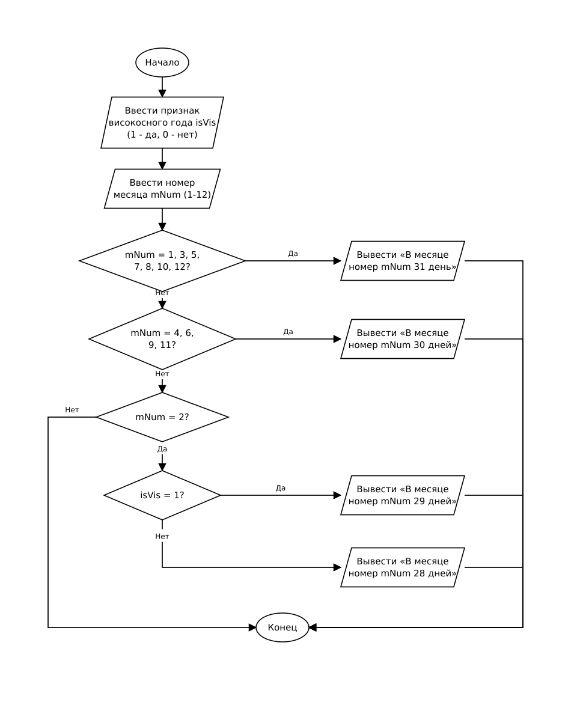

# Домашнее задание к работе 7

## Условие задачи (Вариант 2)

Написать программу, которая определяет количество дней в месяце по его номеру (от 1 до 12). Для февраля (номер 2) программа должна учитывать, является ли год високосным (1 — високосный, 0 — невисокосный), и выводить соответственно 29 или 28 дней. Для реализации выбора количества дней использовать оператор-переключатель `switch`.

---

## 1. Алгоритм и блок-схема

### Алгоритм

1. Настроить русскую локализацию для корректного вывода сообщений.
2. Запросить у пользователя и ввести признак високосного года `isVis` (1 — високосный, 0 — невисокосный).
3. Запросить у пользователя и ввести порядковый номер месяца `mNum` (от 1 до 12).
4. С помощью оператора-переключателя `switch (mNum)` определить количество дней:
   - Для месяцев 1, 3, 5, 7, 8, 10, 12 вывести сообщение о том, что в месяце 31 день.
   - Для месяцев 4, 6, 9, 11 вывести сообщение о том, что в месяце 30 дней.
   - Для месяца 2 (февраль) с помощью вложенного оператора `switch (isVis)` проверить признак високосного года:
     - если `isVis == 1`, вывести сообщение о том, что в месяце 29 дней;
     - если `isVis == 0`, вывести сообщение о том, что в месяце 28 дней.
5. Завершить работу программы.

### Блок-схема



---

## 2. Реализация программы

Исходный код программы: [Source.c](Source.c)

---

## 3. Результаты работы программы

Пример 1 — месяц с 31 днем (март):

```
Введите 1 если год високосный, 0 если нет0
Введите номер месяца3
В месяце номер 3 31 день
```

Пример 2 — месяц с 30 днями (апрель):

```
Введите 1 если год високосный, 0 если нет0
Введите номер месяца4
В месяце номер 4 30 дней
```

Пример 3 — февраль високосного года:

```
Введите 1 если год високосный, 0 если нет1
Введите номер месяца2
В месяце номер 2 29 дней
```

Пример 4 — февраль невисокосного года:

```
Введите 1 если год високосный, 0 если нет0
Введите номер месяца2
В месяце номер 2 28 дней
```

---

## 4. Информация о разработчике

- **ФИО:** Аносов Сергей Юрьевич
- **Группа:** бОТИ-261
